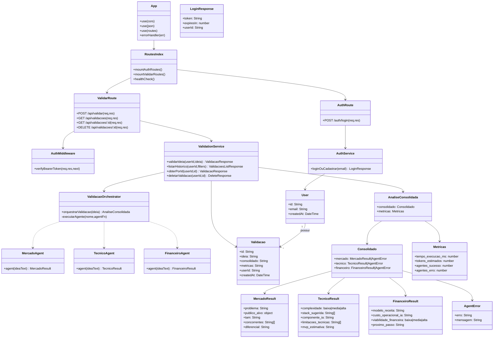

# UML - Diagrama de Classes

```mermaid
classDiagram
    class App {
      +use(cors)
      +use(json)
      +use(routes)
      +errorHandler(err)
    }

    class RoutesIndex {
      +mountAuthRoutes()
      +mountValidarRoutes()
      +healthCheck()
    }

    class AuthRoute {
      +POST /auth/login(req,res)
    }

    class ValidarRoute {
      +POST /api/validar(req,res)
      +GET /api/validacoes(req,res)
      +GET /api/validacoes/:id(req,res)
      +DELETE /api/validacoes/:id(req,res)
    }

    class AuthMiddleware {
      +verifyBearerToken(req,res,next)
    }

    class AuthService {
      +loginOuCadastrar(email) LoginResponse
    }

    class ValidationService {
      +validarIdeia(userId,ideia) ValidacaoResponse
      +listarHistorico(userId,filters) ValidacoesListResponse
      +obterPorId(userId,id) ValidacaoResponse
      +deletarValidacao(userId,id) DeleteResponse
    }

    class ValidacaoOrchestrator {
      +orquestrarValidacao(ideia) AnaliseConsolidada
      -executarAgente(nome,agentFn)
    }

    class MercadoAgent {
      +agent(ideaText) MercadoResult
    }

    class TecnicoAgent {
      +agent(ideaText) TecnicoResult
    }

    class FinanceiroAgent {
      +agent(ideaText) FinanceiroResult
    }

    class User {
      +id: String
      +email: String
      +createdAt: DateTime
    }

    class Validacao {
      +id: String
      +ideia: String
      +consolidado: String
      +metricas: String
      +userId: String
      +createdAt: DateTime
    }

    class LoginResponse {
      +token: String
      +expiresIn: number
      +userId: String
    }

    class AnaliseConsolidada {
      +consolidado: Consolidado
      +metricas: Metricas
    }

    class Consolidado {
      +mercado: MercadoResult|AgentError
      +tecnico: TecnicoResult|AgentError
      +financeiro: FinanceiroResult|AgentError
    }

    class Metricas {
      +tempo_execucao_ms: number
      +tokens_estimados: number
      +agentes_sucesso: number
      +agentes_erro: number
    }

    class MercadoResult {
      +problema: String
      +publico_alvo: object
      +tam: String
      +concorrentes: String[]
      +diferencial: String
    }

    class TecnicoResult {
      +complexidade: baixa|media|alta
      +stack_sugerida: String[]
      +componente_ia: String
      +limitacoes_tecnicas: String[]
      +mvp_estimativa: String
    }

    class FinanceiroResult {
      +modelo_receita: String
      +custo_operacional_ia: String
      +viabilidade_financeira: baixa|media|alta
      +proximo_passo: String
    }

    class AgentError {
      +erro: String
      +mensagem: String
    }

    App --> RoutesIndex
    RoutesIndex --> AuthRoute
    RoutesIndex --> ValidarRoute
    ValidarRoute --> AuthMiddleware
    AuthRoute --> AuthService
    ValidarRoute --> ValidationService
    ValidationService --> ValidacaoOrchestrator
    ValidacaoOrchestrator ..> MercadoAgent
    ValidacaoOrchestrator ..> TecnicoAgent
    ValidacaoOrchestrator ..> FinanceiroAgent
    AuthService --> User
    ValidationService --> Validacao
    ValidationService --> AnaliseConsolidada
    AnaliseConsolidada --> Consolidado
    AnaliseConsolidada --> Metricas
    Consolidado --> MercadoResult
    Consolidado --> TecnicoResult
    Consolidado --> FinanceiroResult
    Consolidado --> AgentError
    User "1" --> "*" Validacao : possui
```
