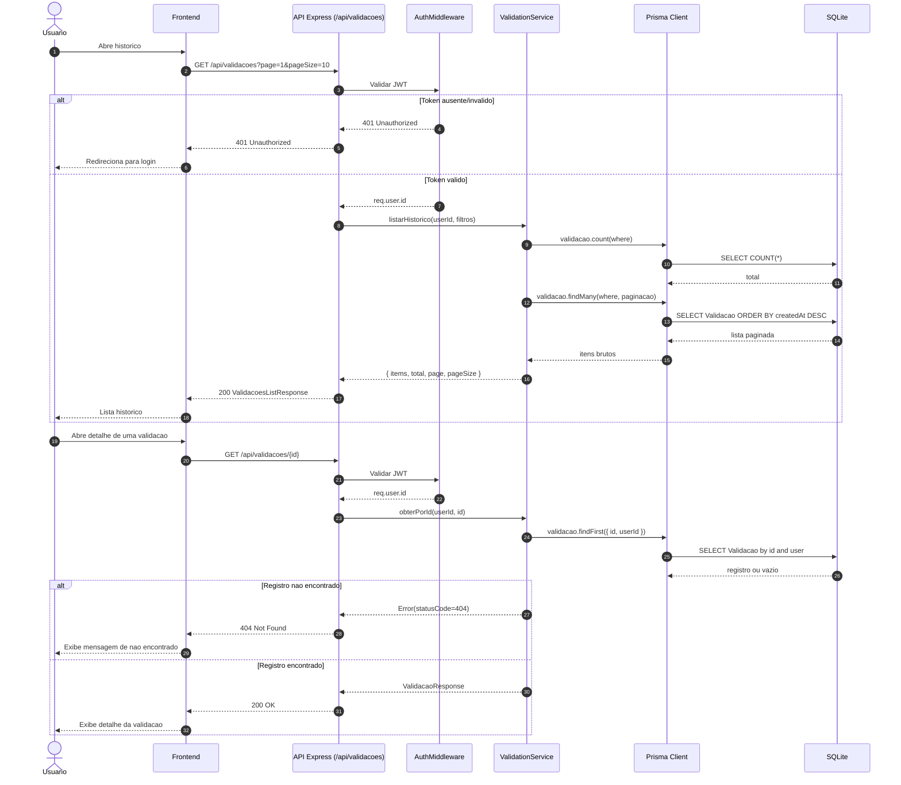

# UML - Sequencia de Historico de Validacoes

```mermaid
sequenceDiagram
    autonumber
    actor U as Usuario
    participant F as Frontend
    participant API as API Express (/api/validacoes)
    participant MW as AuthMiddleware
    participant VS as ValidationService
    participant P as Prisma Client
    participant DB as SQLite

    U->>F: Abre historico
    F->>API: GET /api/validacoes?page=1&pageSize=10
    API->>MW: Validar JWT

    alt Token ausente/invalido
        MW-->>API: 401 Unauthorized
        API-->>F: 401 Unauthorized
        F-->>U: Redireciona para login
    else Token valido
        MW-->>API: req.user.id
        API->>VS: listarHistorico(userId, filtros)
        VS->>P: validacao.count(where)
        P->>DB: SELECT COUNT(*)
        DB-->>P: total
        VS->>P: validacao.findMany(where, paginacao)
        P->>DB: SELECT Validacao ORDER BY createdAt DESC
        DB-->>P: lista paginada
        P-->>VS: itens brutos
        VS-->>API: { items, total, page, pageSize }
        API-->>F: 200 ValidacoesListResponse
        F-->>U: Lista historico
    end

    U->>F: Abre detalhe de uma validacao
    F->>API: GET /api/validacoes/{id}
    API->>MW: Validar JWT
    MW-->>API: req.user.id
    API->>VS: obterPorId(userId, id)
    VS->>P: validacao.findFirst({ id, userId })
    P->>DB: SELECT Validacao by id and user
    DB-->>P: registro ou vazio

    alt Registro nao encontrado
        VS-->>API: Error(statusCode=404)
        API-->>F: 404 Not Found
        F-->>U: Exibe mensagem de nao encontrado
    else Registro encontrado
        VS-->>API: ValidacaoResponse
        API-->>F: 200 OK
        F-->>U: Exibe detalhe da validacao
    end
```
