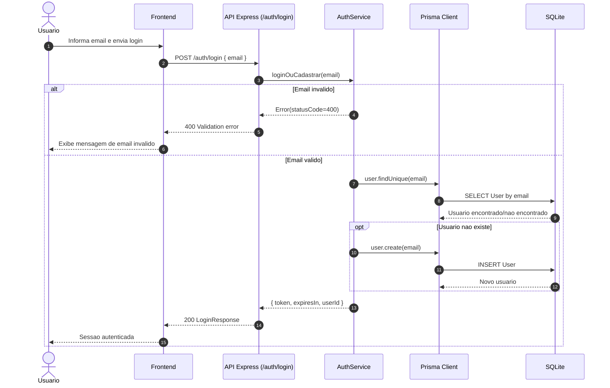

# UML - Sequencia de Login

```mermaid
sequenceDiagram
    autonumber
    actor U as Usuario
    participant F as Frontend
    participant API as API Express (/auth/login)
    participant AS as AuthService
    participant P as Prisma Client
    participant DB as SQLite

    U->>F: Informa email e envia login
    F->>API: POST /auth/login { email }
    API->>AS: loginOuCadastrar(email)

    alt Email invalido
        AS-->>API: Error(statusCode=400)
        API-->>F: 400 Validation error
        F-->>U: Exibe mensagem de email invalido
    else Email valido
        AS->>P: user.findUnique(email)
        P->>DB: SELECT User by email
        DB-->>P: Usuario encontrado/nao encontrado

        opt Usuario nao existe
            AS->>P: user.create(email)
            P->>DB: INSERT User
            DB-->>P: Novo usuario
        end

        AS-->>API: { token, expiresIn, userId }
        API-->>F: 200 LoginResponse
        F-->>U: Sessao autenticada
    end
```
