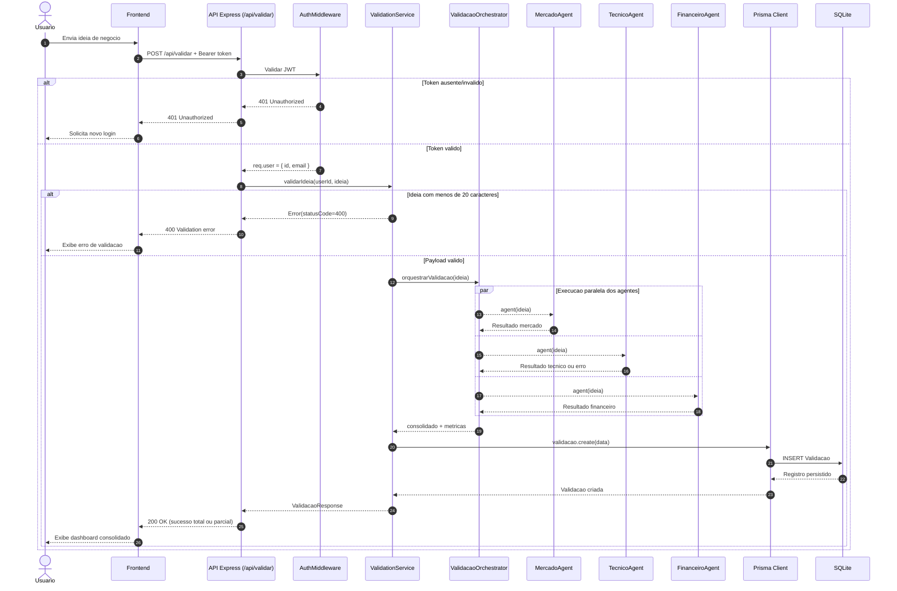

# UML - Sequencia de Validacao de Ideia

## Observacao de fluxo alternativo relevante

O orquestrador implementa tolerancia a falha parcial: se um agente falhar, a chave do agente recebe `{ erro, mensagem }`, os demais resultados sao mantidos e a resposta continua `200` com metricas de sucesso/erro por agente.
