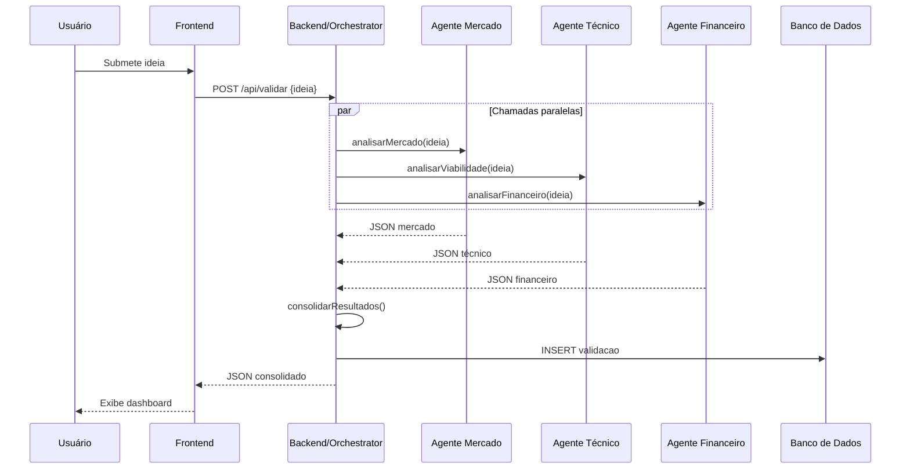

# Validador de Ideia de Negócio com IA
### Mini-Projeto Avaliativo — Três versões por nível de senioridade

> **Ideia:** O usuário descreve uma ideia de negócio e a IA retorna uma análise estruturada com: problema que resolve, público-alvo, concorrência básica e pontos de atenção.

---

## Versão 1 — Iniciante

### Descrição geral
Página web estática com formulário onde o usuário digita sua ideia. Ao submeter, a aplicação envia o texto para a API do OpenAI e exibe a análise gerada diretamente na tela. Foco em funcionar, documentar e participar.

### Stack tecnológica
| Camada | Tecnologia |
|---|---|
| Frontend | HTML, CSS, JavaScript (vanilla) |
| IA | OpenAI API (gpt-3.5-turbo) via `fetch` |
| Testes | Jest |
| Versionamento | Git + GitHub |

### Estrutura de pastas
```
validador-iniciante/
├── index.html
├── style.css
├── app.js
├── README.md
├── docs/
│   └── prompts.md
├── .github/
│   └── pull_request_template.md
└── tests/
    └── app.test.js
```

### Apresentação inicial (§5.1)
Preparar **2–3 slides** contendo: (a) o problema que a aplicação resolve, (b) como a IA atua como parte do produto (não apenas ferramenta de dev), (c) estimativa inicial de viabilidade técnica. Quando exigido, submeter via AVA até **22/05/2026 às 22h**.

### Funcionalidades obrigatórias
- Formulário com campo de texto (ideia do negócio) e botão "Validar".
- Chamada à API do OpenAI com um prompt fixo estruturado.
- Exibição da resposta formatada na própria página.
- Mensagem de loading enquanto aguarda resposta.
- Tratamento básico de erro (ex: chave de API inválida ou sem internet).

### Prompt utilizado na aplicação
```
Você é um consultor de negócios. Analise a seguinte ideia de negócio e retorne uma análise
estruturada em tópicos: 1) Problema que resolve, 2) Público-alvo, 3) Concorrência básica,
4) Pontos de atenção.

Ideia: {ideia do usuário}
```

### Testes automatizados (mínimo 3)
1. `formatarResposta()` deve retornar string não vazia para input válido.
2. `formatarResposta()` deve retornar mensagem de erro para input vazio.
3. `montarPrompt(ideia)` deve incluir o texto da ideia no prompt gerado.

### README mínimo esperado
- Descrição do projeto.
- Tecnologias usadas.
- Como executar localmente (abrir `index.html` no navegador + configurar chave de API no `app.js`).
- O que a IA faz no produto.
- Escolhas técnicas (por que HTML/JS vanilla, por que GPT-3.5-turbo).
- Link para os prompts documentados.

> **Limitação conhecida — segurança:** Nesta versão a chave de API é configurada diretamente no código JavaScript do cliente, ficando exposta ao navegador. Isso deve ser documentado como limitação no README e em `docs/VIABILIDADE.md` (ou PRD). A solução adequada seria um backend intermediário — implementada nas versões Intermediária e Avançada.

### Fluxograma (texto)
```
Usuário preenche formulário
        ↓
JavaScript captura o input
        ↓
Monta prompt com a ideia
        ↓
Envia para API OpenAI (fetch POST)
        ↓
Recebe resposta JSON
        ↓
Exibe análise formatada na tela
```

### Critérios atendidos (Grupo 1)
| Nº | Critério | Como é atendido |
|:---:|---|---|
| 1 | Commits de todos os membros | Cada membro contribui com pelo menos uma funcionalidade ou arquivo |
| 2 | Justificativa da IA | README explica que a IA analisa e estrutura a ideia automaticamente |
| 3 | README com fluxograma | Incluído no repositório, com tecnologias, execução e escolhas técnicas |
| 4 | Prompts documentados | `docs/prompts.md` com o prompt exato usado e as variações testadas |
| 5 | Participação | Todos os membros participam da apresentação dos slides e demonstram conhecimento da solução |
| 6 | Implementação funcional | Página funciona end-to-end com a API |
| 7 | Testes | 3 ou mais testes com Jest |

**Requisito geral obrigatório (não critério de rubrica, mas exigido em §4):** Ao menos 1 Pull Request aberto com `.github/pull_request_template.md` preenchido.

---

## Versão 2 — Intermediário

### Descrição geral
Aplicação web full-stack com backend em Node.js/Express. O frontend React envia a ideia ao backend, que monta o prompt, chama a API do OpenAI e retorna a análise estruturada em JSON. O histórico de validações é salvo no `localStorage`. Foco em integração real de IA no produto, versionamento profissional e documentação completa.

### Stack tecnológica
| Camada | Tecnologia |
|---|---|
| Frontend | React (Vite) |
| Backend | Node.js + Express |
| IA | OpenAI API (gpt-4o-mini) |
| Armazenamento | localStorage (frontend) |
| Testes | Jest + Supertest |
| Versionamento | Git + GitHub (branches + PRs) |

### Estrutura de pastas
```
validador-intermediario/
├── backend/
│   ├── src/
│   │   ├── routes/
│   │   │   └── validar.js
│   │   ├── services/
│   │   │   └── openai.js
│   │   └── app.js
│   ├── tests/
│   │   ├── validar.test.js
│   │   └── openai.test.js
│   ├── .env.example
│   └── package.json
├── frontend/
│   ├── src/
│   │   ├── components/
│   │   │   ├── IdeaForm.jsx
│   │   │   └── AnalysisResult.jsx
│   │   ├── App.jsx
│   │   └── main.jsx
│   └── package.json
├── docs/
│   ├── PRD.md
│   ├── VIABILIDADE.md
│   └── prompts.md
├── .github/
│   └── pull_request_template.md
└── README.md
```

### Funcionalidades obrigatórias
- Formulário com validação de input (campo obrigatório, min. 20 caracteres).
- Backend recebe a ideia, monta o prompt e chama a API.
- Resposta retornada como JSON estruturado (campos separados por área de análise).
- Histórico de análises anteriores salvo no `localStorage` e listado na interface.
- Opção de limpar histórico.
- Variáveis de ambiente para a chave de API (`.env`).

### Prompt utilizado na aplicação
```
Você é um especialista em análise de negócios. Dado a ideia abaixo, retorne um JSON com os campos:
{
  "problema": "<problema que a ideia resolve>",
  "publico_alvo": "<público-alvo principal>",
  "concorrencia": "<principais concorrentes ou alternativas>",
  "pontos_atencao": ["<ponto 1>", "<ponto 2>", "<ponto 3>"]
}

Responda apenas com o JSON, sem texto adicional.

Ideia: {ideia do usuário}
```

### Testes automatizados (mínimo 5)
1. `POST /api/validar` retorna 200 com JSON estruturado para input válido.
2. `POST /api/validar` retorna 400 para input vazio.
3. `POST /api/validar` retorna 400 para input com menos de 20 caracteres.
4. `montarPrompt(ideia)` insere o texto da ideia corretamente no template.
5. `parseResposta(json)` extrai os campos do JSON corretamente.

### User Stories (3, geradas com IA)
1. **Como empreendedor**, quero descrever minha ideia de negócio em linguagem natural e receber uma análise estruturada, para entender rapidamente os pontos fortes e fracos da minha ideia.
2. **Como usuário recorrente**, quero consultar o histórico das minhas análises anteriores, para comparar ideias e acompanhar a evolução do meu pensamento.
3. **Como desenvolvedor do projeto**, quero que a chave de API seja configurada por variável de ambiente, para que o projeto seja seguro e portável.

### Documentos obrigatórios
- `docs/PRD.md` com: visão do produto, público-alvo, funcionalidades, critérios de aceite.
- `docs/VIABILIDADE.md` com: problema identificado, como a IA o resolve, limitações da API, escopo atual vs. futuro.
- `docs/prompts.md` com: todos os prompts testados, versões e decisão final.

### Branches e PRs sugeridos
- `main` → branch protegida
- `feature/backend-api` → implementação do backend
- `feature/frontend-form` → componentes do formulário
- `feature/historico` → funcionalidade de histórico
- `docs/readme-prd` → documentação

### Critérios atendidos (Grupo 2)
| Nº | Critério | Como é atendido |
|:---:|---|---|
| 1 | Commits semânticos + branches + PR | Branch por feature, PR com template completo |
| 2 | Justificativa do uso de IA | README e `docs/VIABILIDADE.md` explicam o problema, o papel da IA e a viabilidade da solução |
| 3 | IA no produto | Backend chama a API e retorna análise estruturada como parte do fluxo do produto |
| 4 | PRD e prompts | `docs/PRD.md` + `docs/prompts.md` |
| 5 | Viabilidade | `docs/VIABILIDADE.md` com análise técnica e próximos passos |
| 6 | 5+ testes | Suite com Jest + Supertest |
| 7 | README completo | Tecnologias, como executar, justificativa técnica |

---

## Versão 3 — Avançado

### Descrição geral
Aplicação web full-stack com arquitetura orientada a agentes. O usuário descreve sua ideia; um orquestrador divide a análise em três agentes especializados (Problema & Mercado, Viabilidade Técnica, Análise Financeira Inicial) que chamam a API de forma independente. Os resultados são consolidados e apresentados em um dashboard com histórico persistido em banco de dados. Foco em prompt engineering intencional, arquitetura robusta e análise técnica aprofundada.

### Stack tecnológica
| Camada | Tecnologia |
|---|---|
| Frontend | React (Vite) + TailwindCSS |
| Backend | Node.js + Express |
| IA | OpenAI API (gpt-4o) — arquitetura multi-agente |
| Banco de Dados | SQLite (via Prisma ORM) |
| Testes | Jest + Supertest + Testing Library |
| Autenticação | JWT (token simples para proteger a API) |
| Versionamento | Git + GitHub (branches + PRs semânticos) |

### Estrutura de pastas
```
validador-avancado/
├── backend/
│   ├── src/
│   │   ├── agents/
│   │   │   ├── mercadoAgent.js
│   │   │   ├── tecnicoAgent.js
│   │   │   └── financeiroAgent.js
│   │   ├── orchestrator/
│   │   │   └── validacaoOrchestrator.js
│   │   ├── routes/
│   │   │   ├── auth.js
│   │   │   └── validar.js
│   │   ├── services/
│   │   │   └── openai.js
│   │   ├── middleware/
│   │   │   └── authMiddleware.js
│   │   ├── prisma/
│   │   │   └── schema.prisma
│   │   └── app.js
│   ├── tests/
│   │   ├── agents/
│   │   ├── orchestrator/
│   │   └── routes/
│   ├── .env.example
│   └── package.json
├── frontend/
│   ├── src/
│   │   ├── components/
│   │   │   ├── IdeaForm/
│   │   │   ├── AnalysisDashboard/
│   │   │   └── HistoryList/
│   │   ├── hooks/
│   │   │   └── useValidacao.js
│   │   ├── services/
│   │   │   └── api.js
│   │   ├── App.jsx
│   │   └── main.jsx
│   └── package.json
├── docs/
│   ├── PRD.md
│   ├── VIABILIDADE.md
│   ├── prompts.md
│   ├── user-stories.md
│   └── uml/
│       ├── diagrama-sequencia.md   ← Mermaid
│       └── diagrama-classes.md    ← Mermaid
├── .github/
│   ├── pull_request_template.md
│   └── CODEOWNERS
└── README.md
```

### Arquitetura multi-agente

```
Usuário envia ideia
        ↓
[Orchestrator]
        ↓ (paralelo)
┌───────────────┬────────────────┬──────────────────┐
│ Agente Mercado│ Agente Técnico │ Agente Financeiro │
│  (problema,   │  (stack,       │  (estimativa,     │
│  público-alvo,│   complexidade,│   modelo de       │
│  concorrência)│   limitações)  │   receita básico) │
└───────────────┴────────────────┴──────────────────┘
        ↓ (consolidação)
[Orchestrator monta resposta final]
        ↓
Retorna JSON consolidado ao frontend
        ↓
Persiste no banco de dados
        ↓
Exibe dashboard com score e recomendações
```

### Prompt engineering — exemplos por agente

**Agente de Mercado:**
```
Você é um analista de mercado sênior. Analise a ideia de negócio abaixo e retorne um JSON com:
{
  "problema": "<descrição precisa do problema resolvido>",
  "publico_alvo": { "primario": "<>", "secundario": "<>" },
  "tam": "<estimativa qualitativa do tamanho do mercado>",
  "concorrentes": ["<concorrente 1>", "<concorrente 2>"],
  "diferencial": "<o que diferencia essa ideia das alternativas>"
}
Seja objetivo. Responda apenas com o JSON.
Ideia: {ideia}
```

**Agente Técnico:**
```
Você é um arquiteto de software. Avalie a viabilidade técnica da ideia abaixo e retorne:
{
  "complexidade": "baixa|média|alta",
  "stack_sugerida": ["<tech 1>", "<tech 2>"],
  "componente_ia": "<como a IA seria integrada no produto>",
  "limitacoes_tecnicas": ["<limitação 1>", "<limitação 2>"],
  "mvp_estimativa": "<tempo estimado para MVP em semanas>"
}
Seja objetivo. Responda apenas com o JSON.
Ideia: {ideia}
```

**Agente Financeiro:**
```
Você é um analista financeiro de startups. Para a ideia abaixo, retorne:
{
  "modelo_receita": "<freemium|assinatura|transação|etc>",
  "custo_operacional_ia": "<estimativa qualitativa com API paga>",
  "viabilidade_financeira": "baixa|média|alta",
  "proximo_passo": "<ação concreta para validar financeiramente>"
}
Seja objetivo. Responda apenas com o JSON.
Ideia: {ideia}
```

### Diagrama de sequência (Mermaid)


### User Stories (3)
1. **Como empreendedor**, quero submeter minha ideia e receber análises de mercado, técnica e financeira em uma única tela, para tomar uma decisão informada sobre continuar ou pivotar.
2. **Como usuário autenticado**, quero acessar o histórico de todas as minhas validações passadas, para acompanhar a evolução das minhas ideias ao longo do tempo.
3. **Como desenvolvedor**, quero que cada agente seja independente e testável isoladamente, para facilitar a manutenção e evolução da arquitetura.

### Testes automatizados (mínimo 5)
1. `mercadoAgent(ideia)` retorna JSON com todos os campos esperados.
2. `tecnicoAgent(ideia)` retorna JSON com `complexidade` sendo "baixa", "média" ou "alta".
3. `financeiroAgent(ideia)` retorna JSON com `modelo_receita` preenchido.
4. `validacaoOrchestrator(ideia)` retorna objeto consolidado com campos dos três agentes.
5. `POST /api/validar` retorna 401 sem token de autenticação.
6. `POST /api/validar` com token válido persiste resultado no banco e retorna 200.
7. *(Bônus)* Cobertura ≥ 30% medida com `jest --coverage`.

### Documento de viabilidade aprofundado (`docs/VIABILIDADE.md`)
Deve conter:

| Seção | Conteúdo |
|---|---|
| Problema identificado | Empreendedores perdem tempo e dinheiro validando ideias sem feedback estruturado |
| Papel da IA | Substituição de consultoria inicial cara; análise em segundos via LLM |
| Limitações técnicas | Custo de tokens com GPT-4, alucinações em estimativas financeiras, ausência de dados de mercado reais |
| Custo/benefício | Estimativa de custo por análise (~$0,02–0,05 com gpt-4o-mini); valor percebido pelo usuário alto |
| Escopo implementado | Análise textual, histórico persistido, 3 agentes especializados |
| Proposta futura | Integração com APIs de dados reais (Crunchbase, Google Trends), exportação em PDF, modo comparativo entre ideias |

### Critérios atendidos (Grupo 3)
| Critério | Como é atendido |
|---|---|
| Convenção de commits por todos | Commits semânticos (`feat:`, `fix:`, `docs:`) em todos os membros, rastreáveis no histórico |
| Justificativa técnica da IA | README e VIABILIDADE explicam por que GPT-4o e por que arquitetura de agentes |
| IA essencial ao produto | Sem os agentes, o produto não existe — a análise é o core |
| Arquitetura + user stories + PRD | Pasta `docs/` completa com todos os artefatos |
| UML | Diagrama de sequência + diagrama de classes em Mermaid |
| Viabilidade aprofundada | Análise técnica, custo/benefício, limitações e próximos passos concretos |
| 5+ testes | Suite com Jest + Supertest, meta de 30% de cobertura |

---

## Comparativo dos três níveis

| Aspecto | Iniciante | Intermediário | Avançado |
|---|---|---|---|
| Frontend | HTML/CSS/JS | React (Vite) | React + TailwindCSS |
| Backend | Nenhum (chamada direta do browser) | Node.js + Express | Node.js + Express + Prisma |
| Banco de dados | Nenhum | localStorage | SQLite |
| IA | 1 chamada simples | 1 chamada estruturada (JSON) | 3 agentes paralelos |
| Autenticação | Nenhuma | Nenhuma | JWT |
| Testes | 3 (Jest) | 5 (Jest + Supertest) | 7+ (Jest + Supertest + coverage) |
| Documentação | README + prompts.md | README + PRD + VIABILIDADE + prompts | README + PRD + VIABILIDADE + prompts + UML + user stories |
| PRs | 1 ou mais (sem restrição) | Branches por feature + PR com template | Branches semânticos + PR conectados a decisões de produto |
